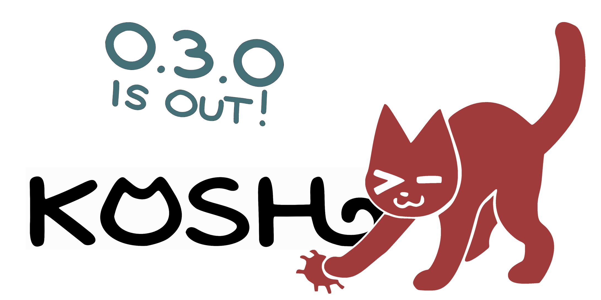

[](https://github.com/toiletbril/kosh/actions/workflows/ci.yml)

# koshka-oriented shell



## Contents

- [Install](#install)
- [Quick look](#quick-look)
  - [How to use it](#how-to-use-it)
  - [Shell linter, formatter, and language server](#shell-linter-formatter-and-language-server)
  - [Interactive shell and command interpreter](#interactive-shell-and-command-interpreter)
  - [Builtins and interactive editor](#builtins-and-interactive-editor)
  - [Koshkit](#koshkit)
- [Development](#development)
  - [Prerequisites](#prerequisites)
  - [Build](#build)

## Install

**Koshka** supports `amd64` Linux and Windows, and `aarch64` macOS.

```sh
# on Linux, macOS, or any system with a POSIX shell:
curl -fsSL "https://fennec.support/kosh/install" | sh

# on Windows, Powershell:
irm "https://fennec.support/kosh/install" | iex

# with Docker, as an Alpine image:
docker run --rm -it ghcr.io/toiletbril/kosh
```

Binaries and their checksums used are on the
[Releases](https://github.com/toiletbril/kosh/releases) page. To build from
source, see [Development](#development).

To set up the universal language server and formatter in an editor, follow its
guide:

- [VS Code](vscode/README.md)
- [Zed](zed/README.md)
- [Neovim](nvim/lsp.lua)

## Quick look

| Koshka has the best interactive tab selector |
| :-: |
|  |

**Koshka** is the Russian word for a cat.

**Koshka** is an absurdly fast and tiny cross-platform interpreter, an
interactive shell, a formatter, and a language server. Koshka is fully
compatible with Bash 5.3 and Dash.

Koshka includes about 300 built-in ShellCheck diagnostics. It is usually five
times faster than Bash and more than 100 times faster than ShellCheck.

| Koshka analyzes a 400,000-line shell script in about 1,5 seconds |
| :-: | 
|  |

Besides shell scripts, Koshka is able to analyze common supported formats for
mistakes in Bash code, including the following:

- GitHub Actions, Gitea Actions, Forgejo Actions, and GitLab CI.
- CircleCI, Azure Pipelines, Bitbucket Pipelines, Buildkite, Travis CI, Google
  Cloud Build, Drone, and Woodpecker.
- Ansible, Dockerfile, Containerfile, Compose, and Kubernetes files.
- Makefiles, Justfiles, Taskfiles, and RPM spec files.
- Markdown files, `package.json` scripts, VS Code tasks, and Dev Container
  files.

| Koshka provides instant shell diagnostics for Scripts, Dockerfiles, GitHub CI, Ansible via LSP |
| :-: | 
|  |

LSP has completions and formatter built-in. It also provides hover diagnostics
and symbolizes all source files.

| Koshka helps writing code |
| :-: | 
|  |

### How to use it

`kosh` is the **Koshka** binary.

**Koshka** aims to be a complete, fast, portable replacement for ShellCheck and
Bash. Linux, macOS, and Windows are first-tier support platforms with
equivalent behavior on all three systems.

The shell is designed to work sensibly without any configuration. The Linux
binary is static and does not use the C++ standard library. **Koshka** can use
its own utilities when coreutils are unavailable. 

### Shell linter, formatter, and language server

| Flag | Description |
| :-- | :-- |
| `kosh --lint` | `kosh --lint` checks complete Bash and POSIX shell syntax and about 300 built-in ShellCheck and native diagnostics. It reads shell source from standard input, `-c` command strings, or multiple files.<br><br>In host files, the linter analyzes only embedded `sh`, `bash`, or `kosh` regions while rejecting unsupported files.<br><br>ShellCheck disable comments accept diagnostic numbers and Koshka diagnostic names. With files, `--apply` writes non-conflicting safe fixes and reports the remaining diagnostics. |
| `kosh --format` | `kosh --format` formats standard input or one named file without running it. It uses two-space indentation and wraps at safe token boundaries within 80 columns. Use `--apply` to overwrite files with new formatting.<br><br>The formatting style cannot be configured. |
| `kosh --as-language-server` | `kosh --as-language-server` communicates over standard input and output. It provides diagnostics, quick fixes, completion, navigation, command help, semantic tokens, a document outline, and rename support.<br><br>The language server recognizes the same embedded shell regions as the linter. The editor's host language service handles the surrounding syntax.<br><br>To set up the language server in your editor, see [Install](#install). |

### Interactive shell and command interpreter

For more details, see the [manual page](docs/kosh.1).

```bash
$ man docs/kosh.1
```

**Koshka** runs with four moods across three shell identities. Zsh provides a
similar feature through its `emulate` builtin.

The default `kosh` mood is a strict superset of Bash with analysis and
optimization enabled. The other moods are `bash`, `bash-posix`, and `sh`. The
`bash-posix` mood provides Bash behavior with its POSIX mode enabled.

Before running a command, **Koshka** analyzes and optimizes the complete script.

| Flag | Description |
| :-- | :-- |
| `--mood`, `-M` | The `--mood` option, or `-M`, selects `kosh`, `bash`, `bash-posix`, or `sh`. The default is `kosh`. A binary symlinked as `sh`, `dash`, or `bash` selects the matching mood and disables diagnostics. `set --mood` changes the mood at runtime. |
| `-W`, `-WW`, `-WWW` | In the default mood, `-W` retains the default severities, `-WW` demotes lenient errors to warnings, and `-WWW` also demotes strict errors. In other moods, `-W` enables strict warnings, `-WW` also enables lenient warnings, and `-WWW` also enables annoying warnings. |
| `-I` | The `-I` option enables mimicry. **Koshka** detects `sh`, `dash`, and `bash` shebangs and runs each script in the matching mood. The current diagnostics setting is preserved. |
| `--init-moods`, `-L` | The `--init-moods` option, or `-L`, accepts a comma-separated list of moods whose startup files will be used. Its default value is the selected mood. |
| `KOSH_FLAGS` | The `KOSH_FLAGS` environment variable sets default flags. Command-line flags override them.<br><br>When `KOSH_FLAGS` or the command line contains an invalid flag or argument, a login shell skips its startup files and opens a rescue session. |

### Builtins and interactive editor

The interactive mode takes inspiration from
[fish](https://github.com/fish-shell/fish-shell). It provides syntax
highlighting, word movement, editing controls, UTF-8 support, display-width
handling for wide characters, multiline editing, history search, and persistent
history. `kosh` does not use readline, so readline configuration is ignored.

**Koshka** has more than 50 builtins, including Bash and POSIX builtins. Every
builtin supports `--help`. Additional builtins include the following commands.

- `z` is a port of [zoxide](https://github.com/ajeetdsouza/zoxide).
- `bench` provides built-in benchmark infrastructure inspired by Performance
  Optimizer Observation Platform ([poop](https://github.com/andrewrk/poop)).
- `assimilate` provides transactional installation on an SSH target.

**Koshka** also implements arbitrary precision arithmetic, including floats, in
`calc` builtin and in the default mood.

### Koshkit

The `koshkit` builtin bundles a BusyBox-style set of small core utilities.

- File utilities include `cp`, `mv`, `ln`, and `rm`.
- Search utilities include `find` and `grep`.
- Process utilities include `killall`, `pkill`, `ps`, `timeout`, and `nproc`.
- Minimal implementations of `calc` and `make` are included.

Every implemented utility is at least POSIX compliant.

The `good` and `evil` utilities are listed below. The options of each utility
are described by its `--help`.

| Utility | Description |
| :-- | :-- |
| `evil` | Reports what the machine is and how it is running. |
| `evildisk` | Reports filesystem capacity and disk health data. |
| `evilfiles` | Lists the files that running processes hold open. |
| `evilfs` | Reports the filesystems mounted on the host. |
| `evilio` | Reports system and process I/O activity. |
| `eviliso` | Reports namespaces, cgroups, sessions, remote connections, container runtimes, containers, and Kubernetes. |
| `evillogs` | Reports core dumps and system logs. |
| `evilnet` | Reports the addresses assigned to each interface. |
| `evilps` | Shows running processes as a tree. |
| `evilss` | Reports visible network sockets. |
| `goodcore` | Captures or packages a core dump with its executable, mapped libraries, and host metadata. |
| `goodfsw` | Reports changes under the paths it watches. |
| `goodnode` | Reports inode metadata and a CRC32C checksum. |
| `goodstat` | Presents file metadata as a readable report. |

# Development

This software began as a late April Fools' joke. It is written from scratch in a
macro-heavy C++23 dialect and is compiled with `-nostdlib++`. The executable
links only to the C library.

Development happens on `staging`. The branch may be broken. The `master` branch
should pass all tests.

## Prerequisites

A native build needs the following tools.

* Install GNU Make, Clang 18 or later with C++23 support, libc development
  files, and headers for the target platform. Linux builds also need Linux
  kernel headers.
* The default debug build needs the AddressSanitizer and
  UndefinedBehaviorSanitizer runtimes from `compiler-rt`.
* The test suite needs Bash 5.3, Dash, and Python 3.
* The build and test scripts need `mkdir`, `rm`, `cp`, and `printf` from the
  host.
* The full test suite needs `cat`, `cmp`, `diff`, `find`, `grep`, `head`, `sed`,
  and `strings`. Interactive tests also need `script` and `stty`. Process
  supervision needs `setsid` or Perl.

A complete Alpine setup can be installed with the following package set.

```bash
apk add --no-cache \
  git git-doc make build-base musl-dev linux-headers clang llvm lld \
  compiler-rt bash dash zsh yash busybox coreutils mandoc python3
```

The benchmark needs Bash, Dash, and Python 3. Zsh, Yash, and BusyBox ash provide
optional comparison rows. The coverage report needs `llvm-profdata` and
`llvm-cov` from the matching LLVM installation. Documentation checks use
`mandoc`. Formatting and static checks use `clang-format` and `clang-tidy` from
Clang 18 or later.

Each cross-compilation target needs its matching toolchain. Zig builds the Zig
targets and cross-compiles Linux release binaries. MinGW-w64 builds Windows
targets. Osxcross with a macOS SDK builds Darwin arm64 targets. `cosmoc++` builds
the Cosmopolitan modes.

## Build

The `MODE` variable controls the build type.

* `rel` is an optimized build.
* `prof` is an optimized build with debug symbols for profiling.
* `cov` is an optimized build with debug symbols for collecting coverage.
* `dbg` includes all symbols, AddressSanitizer, and UndefinedBehaviorSanitizer.
* `cosmo` is an optimized build that uses `cosmoc++` from the Cosmopolitan
  toolchain.
* `cosmo_dbg` is a debug Cosmopolitan build.

`TARGET` defaults to the host platform and accepts `Linux`, `Windows_NT`, or
`Darwin`.
A non-Windows host cross-compiles `TARGET=Windows_NT` with MinGW. A non-Darwin
host cross-compiles `TARGET=Darwin ARCH=arm64` with osxcross. Linux is a native
target.

The `CXXFLAGS` environment variable appends flags to the build commands.

```bash
$ make MODE=<rel/prof/dbg/cov/cosmo/cosmo_dbg>
$ make MODE=rel TARGET=Windows_NT
$ make MODE=rel TARGET=Darwin ARCH=arm64
$ ./kosh --help
```

Zig can also build the `dbg` and `rel` modes.

```bash
$ zig build --release=fast
$ ./zig-out/bin/kosh --help
```

Install or uninstall the selected build with the following commands.

```bash
$ export PREFIX=/usr/local
$ make install
$ make uninstall
```

Assuming the same arch and target, the running binary can install itself on an
SSH target with a builtin command: `assimilate user@host`.

Meow.

---


